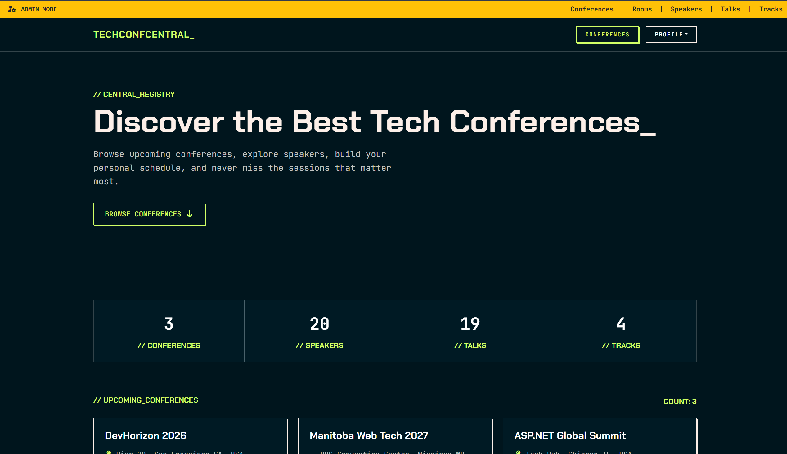
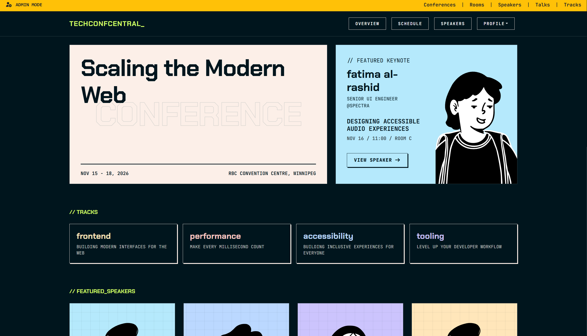

# TechConfCentral

TechConfCentral is an ASP.NET Core MVC web application for discovering and managing technology conferences. Users can browse conferences, view schedules, explore speakers, save talks to a personal schedule, and administrators can manage conference information through a secured administration portal.

## Homepage


## Conference Page


---

## Features

### Public Users
- Browse upcoming conferences
- View conference information
- Browse conference schedules
- Filter schedules by:
  - Day
  - Track
  - Room
- View featured speakers
- View detailed speaker profiles
- View detailed talk information

### Registered Users
- Register and log in using ASP.NET Core Identity
- Save talks to a personal schedule
- Remove saved talks
- View saved talks

### Administrators
Full CRUD functionality for:

- Conferences
- Talks
- Speakers
- Tracks
- Rooms

Additional business rules include:

- Prevent overlapping talks in the same room
- Ensure talks occur within conference dates
- Prevent invalid conference dates

---

## Technologies Used

- ASP.NET Core MVC
- C#
- Entity Framework Core
- SQL Server
- ASP.NET Core Identity
- Bootstrap 5
- HTML5
- CSS3
- Font Awesome

---

## Architecture

The project follows a layered architecture.

```
Presentation Layer
    Controllers
    Views
    ViewModels
        │
Business Logic Layer
    Services
        │
Data Access Layer
    Repositories
        │
Entity Framework Core
        │
SQL Server
```

---

## Project Structure

```
TechConfCentral
│
├── Controllers
├── Models
├── ViewModels
├── Views
├── DAL
│   └── Repositories
├── BLL
│   └── Services
├── ViewComponents
├── Data
└── wwwroot
```

---

## Main Entities

- Conference
- Talk
- Speaker
- Track
- Room
- SavedTalk
- ApplicationUser

Relationships include:

- Conference → Talks (One-to-Many)
- Speaker → Talks (One-to-Many)
- Room → Talks (One-to-Many)
- Track → Talks (One-to-Many)
- User ↔ Talks (Many-to-Many through SavedTalk)

---

## Business Rules

### Conferences
- End date cannot be before the start date.

### Talks
- Must occur within conference dates.
- End time must be after start time.
- Rooms cannot have overlapping talks.

### Saved Talks
- Users cannot save duplicate talks.

---

## Dynamic Features

- Featured talks
- Featured speakers
- Keynote session
- Schedule filtering
- Statistics displayed on the landing page
- View Components for reusable speaker and talk details

---

## Security

- ASP.NET Core Identity authentication
- Role-based authorization
- Anti-forgery validation
- Authorization policies for administrators

---

## Screens

### Public

- Home
- Conference Details
- Schedule
- Speakers
- Saved Talks
- Login
- Register

### Administration

- Conference Management
- Talk Management
- Speaker Management
- Room Management
- Track Management

---

## Getting Started

### Prerequisites

- .NET 9 SDK
- SQL Server
- Visual Studio 2022

### Clone the repository

```bash
git clone https://github.com/yourusername/TechConfCentral.git
```

### Update the connection string

Modify **appsettings.json**

```json
"ConnectionStrings": {
  "DefaultConnection": "Your SQL Server connection string"
}
```

### Apply migrations

```bash
Update-Database
```

or

```bash
dotnet ef database update
```

### Run the application

```bash
dotnet run
```

---

## Future Improvements

- Conference image uploads
- Speaker social media links
- Search functionality
- Conference registration
- Calendar export
- Email reminders
- Pagination
- Responsive admin dashboard
- Analytics and reporting

---

## Author

**Oghenefejiro Stephanie Abere**

Computer Engineering Graduate | Software Development Student

```
ASP.NET Core MVC • C# • Entity Framework Core • SQL Server
```